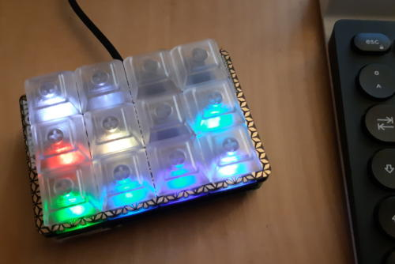

# Multibow

Find it on GitHub:
[thediveo/multibow](https://github.com/thediveo/multibow).



Multibow adds ease-of use support for **multiple layouts** to [Pimoroni
Keybow](https://shop.pimoroni.com/products/keybow) macro keyboards. Simply
switch between the installed layouts by pressing a special key combination
(defaults to press-hold key #11, then tap key #5). And you can even control the key LEDs brightness (press-hold key #11, then tap key #8 to change brightness).

> "_Keybows_" are solderless DIY 4x3 mechanical USB keyboards, powered by a
> Raspberry Pi. And yes, these days even _keyboards_ now run Linux and script
> interpreters...

And yes, this is probably a New Year's project slightly gone overboard ...
what sane reason is there to end up with a Lua-scripted multi-layout keyboard
"operating" system and a bunch of automated unit test cases?

## Installation

1. Download the [Pibow
   firmware](https://github.com/pimoroni/keybow-firmware/releases) and copy
   all files inside its `sdcard/` subdirectory onto an empty, FAT32 formatted
   microSD card. Copy only the files **inside** `sdcard/`, but do **not**
   place them into a ~~`sdcard`~~ directory on your microSD card.

2. Download all files from the `sdcard/` subdirectory of this repository and
   then copy them onto the microSD card. This will overwrite but one file
   `key.lua`, all other files are new.
   - download recent stable
     [sdcard.zip](https://minhaskamal.github.io/DownGit/#/home?url=https://github.com/TheDiveO/multibow/tree/master/sdcard)
     – courtesy of Minhas Kamal's incredibly useful
     [DownGit](https://github.com/MinhasKamal/DownGit) service which lets
     users directly download GitHub repository directories as .zip files.
     _Please note that we're not responsible for the DownGit service and its
     integrity, so be cautious when downloading files._

## Multiple Keyboard Layouts

To enable one or more multibow keyboard layouts, edit `sdcard/keys.lua`
accordingly in order to "`require`" them. The default configuration looks as
follows:

```lua
require "layouts/shift" -- for cycling between layouts.
require "layouts/vsc-golang" -- debugging Go programs in VisualStudio Code.
require "layouts/kdenlive" -- editing video using Kdenlive.
require "layouts/empty" -- empty, do-nothing layout.
```

> You can disable a specific keyboard layout by simply putting two dashes `--`
> in front of the `require "..."`, making it look like `--require "..."`.

## Layouts

The default setup activates the following macro keyboard layouts shown below.

> You can switch (cycle) between them by pressing and holding key #11
> (top-left key in landscape), then tapping key #5 (immediately right to #11),
> and finally releasing both keys.

### Debug Go in VisualStudio Code

Debug Go programs and packages in VisualStudio Code with its Go extension.

```text
┌╌╌╌╌┐  ┌╌╌╌╌┐  ┌╌╌╌╌┐  ┌╌╌╌╌┐
┊ 11 ┊  ┊  8 ┊  ┊  5 ┊  ┊  2 ┊
└╌╌╌╌┘  └╌╌╌╌┘  └╌╌╌╌┘  └╌╌╌╌┘

╔════╗  ╔════╗  ┌╌╌╌╌┐  ╔════╗
║ 10 ║  ║  7 ║  ┊  4 ┊  ║  1 ║
╚════╝  ╚════╝  └╌╌╌╌┘  ╚════╝
⏹STOP   ↺RELOAD         ☑TSTPKG
╔════╗  ╔════╗  ╔════╗  ╔════╗
║  9 ║  ║  6 ║  ║  3 ║  ║  0 ║
╚════╝  ╚════╝  ╚════╝  ╚════╝
  ▮▶    ⭢STEP   ⮧INTO   ⮥OUT
```

* ▮▶ starts, continues, or pauses the program to be debugged.
* ⮧INTO steps _into_ a function call.
* ⭢STEP steps _over_ a line/function call.
* ⏹STOP stops debugging
* ↺RELOAD reloads the program being debugged.
* ☑TSTPKG activates the command "go: test package".

### Kdenlive Video Editor

_coming soon..._

### SHIFT Overlay

This layout provides a SHIFT key. Only when pressed and held, two additional
keys become active for controlling the brightness of the Keybow LEDs and for
switching between multiple keyboard layouts.

Simply pressing and then immediately releasing the SHIFT key without pressing
any of the other keys activates the SHIFT layer in other Multibow keyboard
layouts that are SHIFT-aware.

> **NOTE:** press and hold SHIFT, then use →LAYOUT and 🔆BRIGHT. The SHIFT key
> is always active, regardless of keyboard layout. The other keys in this
> layout become only active _while_ holding SHIFT.

```text
╔════╗  ╔╌╌╌╌╗  ╔╌╌╌╌╗  ┌╌╌╌╌┐
║ 11 ║  ┊  8 ┊  ┊  5 ┊  ┊  2 ┊
╚════╝  ╚╌╌╌╌╝  ╚╌╌╌╌╝  └╌╌╌╌┘
⇑SHIFT  →LAYOUT 🔆BRIGHT
┌╌╌╌╌┐  ┌╌╌╌╌┐  ┌╌╌╌╌┐  ┌╌╌╌╌┐
┊ 10 ┊  ┊  7 ┊  ┊  4 ┊  ┊  1 ┊
└╌╌╌╌┘  └╌╌╌╌┘  └╌╌╌╌┘  └╌╌╌╌┘

┌╌╌╌╌┐  ┌╌╌╌╌┐  ┌╌╌╌╌┐  ┌╌╌╌╌┐
┊  9 ┊  ┊  6 ┊  ┊  3 ┊  ┊  0 ┊
└╌╌╌╌┘  └╌╌╌╌┘  └╌╌╌╌┘  └╌╌╌╌┘
```

* press ⇑SHIFT, release ⇑SHIFT: if a keyboard layout has a SHIFT layer, then
  this activates and deactivates this ⇑SHIFT layer.
* press ⇑SHIFT, tap →LAYOUT, release ⇑SHIFT: switches to next keyboard layout.
* press ⇑SHIFT, tap 🔆BRIGHT, release 🔆BRIGHT: changes the keyboard LED
  brightness in three different brightness steps (70% → 100% → 40% → 70% →
  ...).

### Empty

Just as its name says: an empty keyboard layout – useful if you want to have
also a "no" layout with no functionality whatsoever to switch to. (_This
layout by courtesy of Margaret Thatcher._)

```text
┌╌╌╌╌┐  ┌╌╌╌╌┐  ┌╌╌╌╌┐  ┌╌╌╌╌┐
┊ 11 ┊  ┊  8 ┊  ┊  7 ┊  ┊  6 ┊
└╌╌╌╌┘  └╌╌╌╌┘  └╌╌╌╌┘  └╌╌╌╌┘
┌╌╌╌╌┐  ┌╌╌╌╌┐  ┌╌╌╌╌┐  ┌╌╌╌╌┐
┊ 10 ┊  ┊  7 ┊  ┊  4 ┊  ┊  1 ┊
└╌╌╌╌┘  └╌╌╌╌┘  └╌╌╌╌┘  └╌╌╌╌┘
┌╌╌╌╌┐  ┌╌╌╌╌┐  ┌╌╌╌╌┐  ┌╌╌╌╌┐
┊  9 ┊  ┊  6 ┊  ┊  3 ┊  ┊  0 ┊
└╌╌╌╌┘  └╌╌╌╌┘  └╌╌╌╌┘  └╌╌╌╌┘
```

## Your Own Multikey Keyboard Layout

You may want to start from our template in `layouts/keymap-template.lua`.

1. copy and rename the new layout file name to something more meaningful.

2. edit your new layout file and change its name which is specified in the
   `kmt.name` element:

    ```lua
    km.keymap = {
        -- IMPORTANT: Make sure to change the keymap name to make it unique!
        name="my-cool-layout",
        -- ...
    }
    ```

3. add key definitions for colors and handlers as necessary, see next for examples.

    * you can specify key handlers either "inline", as you can see from the
      example mapping for key #0:

      ```lua
      km.keymap = {
        -- ...
        [0] = { c={r=1, g=1, b=1}, press=function() mb.tap("a") end},
      }
      ```

      This sets the key #0's LED color to white, and emits an "a" press everytime
      you tap key #0.

    * for more complex handling, you may want to use a dedicated function instead:

      ```lua
      function km.mypress(keyno)
        mb.tap("a")
      end

      km.keymap = {
        -- ...
        [1] = { c={r=1, g=1, b=1}, press=km.mypress}
      }

    * you can also do things on key releases:

      ```lua
      km.keymap = {
        -- ...
        [2] = { c={r=1, g=1, b=1}, release=function() mb.tap("x") end},
      }
      ```

For more details and examples, please have a look at the keyboard layouts in
`layouts/vsc-golang.lua` and `layouts/kdenlive.lua`.

## Licenses

Multibow is (c) 2019 Harald Albrecht and is licensed under the MIT license, see
the [LICENSE](LICENSE) file.

The file `keybow.lua` included from
[pimoroni/keybow-firmware](https://github.com/pimoroni/keybow-firmware) for
testing purposes is licensed under the MIT license, as declared by Pimoroni's
keybow-firmware GitHub repository.

## Developing

Whether you want to dry-run your own keyboard layout or to hack Multibow: use
the unit tests which you can find in the `spec/` subdirectory. These tests
help you in detecting syntax and logic errors early, avoiding the
rinse-and-repeat cycle with copying to microSD card, starting the Keybow
hardware, and then wondering what went wrong, without any real clue as to what
is the cause of failure.

Before your first testing, you'll need to run `./setup-tests.sh` once in order
to install (on Ubuntu-based distributions) the required system distribution and
LuaRocks packages.

Afterwards, simply run `./check.sh` while in the `multibow` repository root
directory to run all tests and linting.

If you want to just test a certain file or directory, then run `busted
spec/layout/kdenlive_spec.lua` to unit test a specific keyboard layout
(or set of layouts) or `busted spec/layout` to check all layouts.
